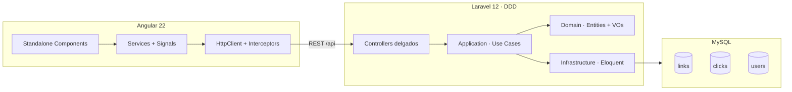
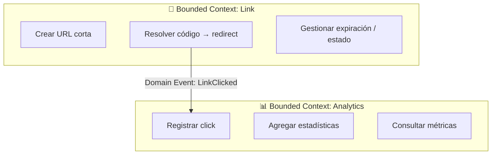
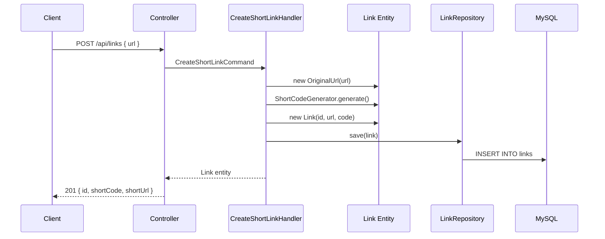
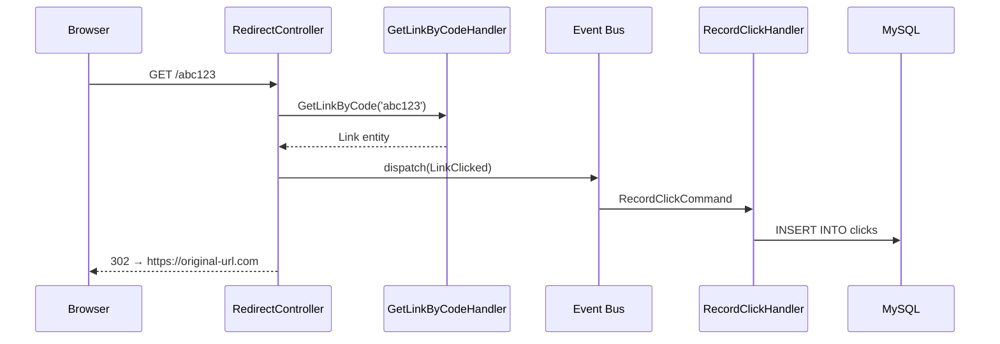
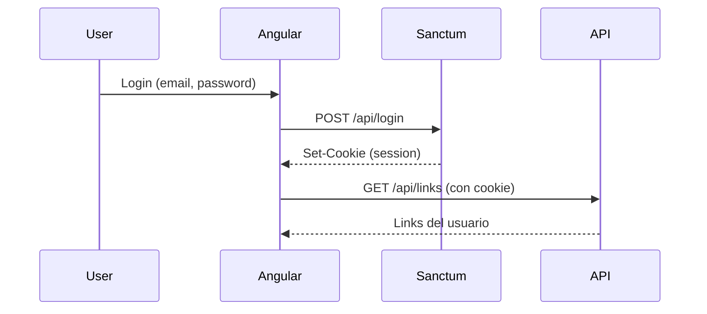
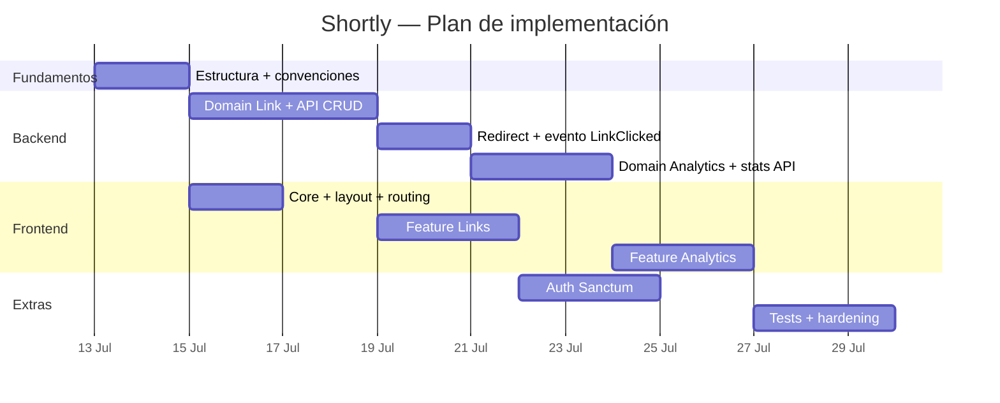

# 🗺️ Hoja de ruta — Shortly

> Acortador de URLs con analíticas · Laravel 12 (DDD) + Angular 22

---

## Tabla de contenidos

1. [Resumen del proyecto](#resumen-del-proyecto)
2. [Estado actual](#estado-actual)
3. [Arquitectura objetivo](#arquitectura-objetivo)
4. [Bounded contexts (DDD)](#bounded-contexts-ddd)
5. [Fase 0 — Fundamentos](#fase-0--fundamentos)
6. [Fase 1 — Dominio Link (Backend)](#fase-1--dominio-link-backend)
7. [Fase 2 — Dominio Analytics (Backend)](#fase-2--dominio-analytics-backend)
8. [Fase 3 — Frontend Angular 22](#fase-3--frontend-angular-22)
9. [Fase 4 — Autenticación](#fase-4--autenticación)
10. [Fase 5 — Calidad y producción](#fase-5--calidad-y-producción)
11. [Orden de implementación](#orden-de-implementación)
12. [Decisiones de diseño](#decisiones-de-diseño)
13. [Anti-patrones a evitar](#anti-patrones-a-evitar)

---

## Resumen del proyecto

**Shortly** es un acortador de URLs con panel de analíticas. El stack:

| Capa | Tecnología |
|------|------------|
| Backend | Laravel 12 · PHP 8.3 · API REST |
| Frontend | Angular 22 · Standalone Components · Signals |
| Base de datos | MySQL 8.4 |
| Infraestructura | Docker Compose (Nginx + PHP-FPM + Angular dev server) |

**Objetivo de arquitectura:**

- **Backend:** Domain-Driven Design (DDD) con capas separadas — el dominio no depende de Laravel ni de Eloquent.
- **Frontend:** Buenas prácticas de Angular 22 — standalone, signals, lazy loading, sin NgModules.

---

## Estado actual

El proyecto tiene una **base técnica sólida**, pero **cero lógica de negocio**. Eso es una ventaja: se puede diseñar la arquitectura correcta desde el principio.

### Infraestructura ✅

```
docker compose up --build
```

| Servicio | Puerto | Descripción |
|----------|--------|-------------|
| `webserver` (Nginx) | `8000` | Proxy al backend Laravel |
| `frontend` (Angular) | `4200` | Dev server |
| `db` (MySQL) | `3307` | Base de datos `shortly` |
| `app` (PHP-FPM) | — | Contenedor Laravel |

### Backend — Esqueleto Laravel 12

| Elemento | Estado |
|----------|--------|
| Modelo `User` + migraciones de framework | ✅ |
| Rutas API (`/api/...`) | ❌ No existen |
| Dominio de negocio (links, clicks) | ❌ |
| Arquitectura DDD | ❌ |
| Paquetes (Sanctum, etc.) | ❌ |

### Frontend — Scaffold Angular 22.0.6

| Elemento | Estado |
|----------|--------|
| Standalone + `bootstrapApplication()` | ✅ |
| Router configurado (sin rutas) | ⚠️ Vacío |
| `HttpClient`, servicios, interceptors | ❌ |
| Features de negocio | ❌ |
| Estructura `core/` / `features/` | ❌ |

---

## Arquitectura objetivo

### Vista general del sistema



### Capas del backend (DDD)

```
┌─────────────────────────────────────────────────────────┐
│  Interfaces (HTTP)                                      │
│  Controllers · Form Requests · API Resources            │
├─────────────────────────────────────────────────────────┤
│  Application                                            │
│  Commands · Queries · Handlers · DTOs                   │
├─────────────────────────────────────────────────────────┤
│  Domain                                                 │
│  Entities · Value Objects · Domain Services · Events    │
├─────────────────────────────────────────────────────────┤
│  Infrastructure                                         │
│  Eloquent Models · Repositories · Mappers · Jobs        │
└─────────────────────────────────────────────────────────┘
```

> **Regla de oro:** las dependencias solo apuntan hacia abajo. El dominio no importa nada de Laravel.

### Capas del frontend (Angular 22)

```
src/app/
├── core/              ← Singletons: HTTP, auth, interceptors, guards
├── shared/            ← Componentes UI reutilizables
├── features/          ← Módulos de negocio (lazy loaded)
│   ├── links/
│   └── analytics/
└── layout/            ← Shell, header, navegación
```

---

## Bounded contexts (DDD)

Para Shortly se definen **dos contextos delimitados** que se comunican mediante eventos de dominio:



| Contexto | Responsabilidad | Agregado raíz |
|----------|-----------------|---------------|
| **Link** | Crear, listar, actualizar y eliminar URLs; generar códigos únicos; redirigir | `Link` |
| **Analytics** | Registrar cada visita; agregar por día, referrer y geolocalización | `Click` |

### Glosario del dominio (Ubiquitous Language)

| Término | Definición |
|---------|------------|
| **Link** | Una URL original asociada a un código corto único |
| **Short Code** | Identificador corto (ej. `abc123`) que resuelve a la URL original |
| **Click** | Un evento de visita registrado cuando alguien accede al código corto |
| **Redirect** | Respuesta HTTP 302 que envía al usuario a la URL original |
| **Stats** | Métricas agregadas de clicks para un link |

---

## Fase 0 — Fundamentos

> **Duración estimada:** 1–2 días  
> **Objetivo:** Fijar convenciones, estructura de carpetas y herramientas antes de escribir features.

### Backend

#### 1. Registrar rutas API

En `bootstrap/app.php`, añadir el archivo de rutas API con prefijo `/api`:

```php
->withRouting(
    web: __DIR__.'/../routes/web.php',
    api: __DIR__.'/../routes/api.php',   // ← nuevo
    commands: __DIR__.'/../routes/console.php',
    health: '/up',
)
```

#### 2. Instalar paquetes

```bash
composer require laravel/sanctum          # Autenticación SPA/API
composer require spatie/laravel-data      # DTOs tipados (opcional)
```

#### 3. Namespaces PSR-4 en `composer.json`

```json
"autoload": {
    "psr-4": {
        "App\\": "app/",
        "Domain\\": "app/Domain/",
        "Application\\": "app/Application/",
        "Infrastructure\\": "app/Infrastructure/"
    }
}
```

#### 4. Convenciones de equipo

- **Formateo:** Laravel Pint (`./vendor/bin/pint`)
- **Tests:** PHPUnit o Pest
- **Commits:** Un commit por feature vertical (dominio + infra + API + test)
- **Branches:** `feature/link-create`, `feature/analytics-dashboard`, etc.

### Frontend

#### 1. Crear estructura de carpetas

```bash
mkdir -p src/app/{core,shared,features,layout}
mkdir -p src/app/core/{api,interceptors,services,guards}
mkdir -p src/app/features/{links,analytics,auth}
mkdir -p src/environments
```

#### 2. Configurar `app.config.ts`

```typescript
import { ApplicationConfig } from '@angular/core';
import { provideRouter, withComponentInputBinding, withViewTransitions } from '@angular/router';
import { provideHttpClient, withInterceptors } from '@angular/common/http';

import { routes } from './app.routes';
import { errorInterceptor } from './core/interceptors/error.interceptor';

export const appConfig: ApplicationConfig = {
  providers: [
    provideHttpClient(withInterceptors([errorInterceptor])),
    provideRouter(
      routes,
      withComponentInputBinding(),
      withViewTransitions(),
    ),
  ],
};
```

#### 3. Environments

```typescript
// src/environments/environment.development.ts
export const environment = {
  production: false,
  apiUrl: 'http://localhost:8000/api',
};
```

#### 4. Calidad de código

```bash
ng add @angular-eslint/schematics   # ESLint
```

Activar en `tsconfig.json`:

```json
"angularCompilerOptions": {
  "strictTemplates": true
}
```

#### 5. Corregir scaffold

- Crear `src/app/app.scss` o eliminar la referencia en `app.ts`
- Añadir `favicon.ico` en `public/`
- Reemplazar la plantilla placeholder de bienvenida del CLI

---

## Fase 1 — Dominio Link (Backend)

> **Duración estimada:** 3–5 días  
> **Objetivo:** CRUD de links, generación de códigos cortos y redirección.

### Estructura de carpetas

```
app/
├── Domain/
│   └── Link/
│       ├── Entities/
│       │   └── Link.php
│       ├── ValueObjects/
│       │   ├── ShortCode.php
│       │   ├── OriginalUrl.php
│       │   └── LinkId.php
│       ├── Repositories/
│       │   └── LinkRepositoryInterface.php
│       ├── Services/
│       │   └── ShortCodeGenerator.php
│       ├── Events/
│       │   └── LinkCreated.php
│       └── Exceptions/
│           ├── InvalidUrlException.php
│           └── ShortCodeAlreadyExistsException.php
│
├── Application/
│   └── Link/
│       ├── CreateShortLink/
│       │   ├── CreateShortLinkCommand.php
│       │   └── CreateShortLinkHandler.php
│       ├── GetLinkByCode/
│       │   ├── GetLinkByCodeQuery.php
│       │   └── GetLinkByCodeHandler.php
│       ├── ListUserLinks/
│       │   ├── ListUserLinksQuery.php
│       │   └── ListUserLinksHandler.php
│       └── DeleteLink/
│           ├── DeleteLinkCommand.php
│           └── DeleteLinkHandler.php
│
├── Infrastructure/
│   └── Persistence/
│       ├── Eloquent/
│       │   ├── Models/LinkModel.php
│       │   └── Repositories/EloquentLinkRepository.php
│       └── Mappers/LinkMapper.php
│
└── Interfaces/
    └── Http/
        ├── Controllers/
        │   ├── Api/LinkController.php
        │   └── RedirectController.php
        ├── Requests/CreateLinkRequest.php
        └── Resources/LinkResource.php
```

### Entidad de dominio (ejemplo)

La entidad `Link` es **rica en comportamiento**, no un simple contenedor de datos:

```php
// Domain/Link/Entities/Link.php
final class Link
{
    public function __construct(
        private readonly LinkId $id,
        private OriginalUrl $originalUrl,
        private ShortCode $shortCode,
        private bool $isActive = true,
        private ?\DateTimeImmutable $expiresAt = null,
    ) {}

    public function deactivate(): void
    {
        $this->isActive = false;
    }

    public function isExpired(): bool
    {
        return $this->expiresAt !== null
            && $this->expiresAt < new \DateTimeImmutable();
    }

    public function canBeAccessed(): bool
    {
        return $this->isActive && !$this->isExpired();
    }
}
```

### Value Objects (ejemplo)

```php
// Domain/Link/ValueObjects/ShortCode.php
final readonly class ShortCode
{
    private const int MIN_LENGTH = 4;
    private const int MAX_LENGTH = 12;
    private const string PATTERN = '/^[a-zA-Z0-9_-]+$/';

    public function __construct(private string $value)
    {
        if (strlen($value) < self::MIN_LENGTH || strlen($value) > self::MAX_LENGTH) {
            throw new \InvalidArgumentException('Short code length invalid');
        }
        if (!preg_match(self::PATTERN, $value)) {
            throw new \InvalidArgumentException('Short code contains invalid characters');
        }
    }

    public function value(): string
    {
        return $this->value;
    }

    public function equals(ShortCode $other): bool
    {
        return $this->value === $other->value;
    }
}
```

### Migración

```php
Schema::create('links', function (Blueprint $table) {
    $table->uuid('id')->primary();
    $table->foreignId('user_id')->nullable()->constrained()->nullOnDelete();
    $table->string('short_code', 12)->unique();
    $table->text('original_url');
    $table->string('title')->nullable();
    $table->timestamp('expires_at')->nullable();
    $table->boolean('is_active')->default(true);
    $table->timestamps();

    $table->index('short_code');
    $table->index(['user_id', 'created_at']);
});
```

### API Endpoints (MVP)

| Método | Ruta | Use Case | Auth |
|--------|------|----------|------|
| `POST` | `/api/links` | `CreateShortLink` | Opcional |
| `GET` | `/api/links` | `ListUserLinks` | Sí |
| `GET` | `/api/links/{id}` | `GetLinkById` | Sí |
| `DELETE` | `/api/links/{id}` | `DeleteLink` | Sí |
| `GET` | `/{code}` | `ResolveAndRedirect` | No |

### Flujo: Crear un link



### Tests

| Tipo | Qué probar |
|------|------------|
| **Unit** | `ShortCode` rechaza caracteres inválidos |
| **Unit** | `Link::isExpired()` con fecha pasada |
| **Unit** | `ShortCodeGenerator` genera códigos únicos |
| **Integration** | `EloquentLinkRepository` persiste y recupera |
| **Feature** | `POST /api/links` devuelve 201 con JSON correcto |

---

## Fase 2 — Dominio Analytics (Backend)

> **Duración estimada:** 2–4 días  
> **Objetivo:** Registrar clicks en cada redirección y exponer estadísticas.

### Estructura de carpetas

```
Domain/Analytics/
├── Entities/Click.php
├── ValueObjects/
│   ├── IpAddress.php
│   ├── UserAgent.php
│   └── Referrer.php
├── Repositories/ClickRepositoryInterface.php
├── Events/LinkClicked.php
└── Services/ClickRecorder.php

Application/Analytics/
├── RecordClick/
│   ├── RecordClickCommand.php
│   └── RecordClickHandler.php
├── GetLinkStats/
│   ├── GetLinkStatsQuery.php
│   └── GetLinkStatsHandler.php
└── ListClicks/
    ├── ListClicksQuery.php
    └── ListClicksHandler.php
```

### Migración

```php
Schema::create('clicks', function (Blueprint $table) {
    $table->id();
    $table->foreignUuid('link_id')->constrained('links')->cascadeOnDelete();
    $table->string('ip_address', 45)->nullable();    // IPv6 compatible
    $table->text('user_agent')->nullable();
    $table->string('referrer')->nullable();
    $table->string('country', 2)->nullable();         // ISO 3166-1 alpha-2
    $table->timestamp('clicked_at');

    $table->index(['link_id', 'clicked_at']);
    $table->index('clicked_at');
});
```

> **Privacidad (GDPR):** considerar hashear o truncar IPs. No almacenar datos personales innecesarios.

### Flujo: Redirección con registro de click



### API Endpoints

| Método | Ruta | Use Case |
|--------|------|----------|
| `GET` | `/api/links/{id}/stats` | `GetLinkStats` |
| `GET` | `/api/links/{id}/clicks` | `ListClicks` (paginado) |

### Respuesta de stats (ejemplo)

```json
{
  "linkId": "uuid-here",
  "totalClicks": 1542,
  "clicksToday": 23,
  "clicksThisWeek": 187,
  "clicksByDay": [
    { "date": "2026-07-10", "count": 45 },
    { "date": "2026-07-11", "count": 62 },
    { "date": "2026-07-12", "count": 23 }
  ],
  "topReferrers": [
    { "referrer": "twitter.com", "count": 89 },
    { "referrer": "direct", "count": 54 }
  ]
}
```

### Evolución: cola de trabajos

Al inicio, `RecordClick` puede ser **síncrono**. Cuando el tráfico crezca:

```php
// Infrastructure/Jobs/RecordClickJob.php
class RecordClickJob implements ShouldQueue
{
    public function __construct(private RecordClickCommand $command) {}

    public function handle(RecordClickHandler $handler): void
    {
        $handler->handle($this->command);
    }
}
```

---

## Fase 3 — Frontend Angular 22

> **Duración estimada:** 4–6 días  
> **Objetivo:** UI funcional conectada al API — crear links, listar, ver estadísticas.

### Principios de arquitectura Angular 22

| Principio | Implementación |
|-----------|----------------|
| **Standalone** | Sin NgModules; cada componente se auto-importa |
| **Signals** | Estado reactivo con `signal()`, `computed()`, `linkedSignal()` |
| **DI funcional** | `inject()` en lugar de constructores |
| **OnPush** | `changeDetection: ChangeDetectionStrategy.OnPush` en todos los componentes |
| **Lazy loading** | `loadComponent` / `loadChildren` por feature |
| **Sin NgRx** | Signals + servicios es suficiente para este tamaño de app |

### Estructura de carpetas

```
src/app/
├── core/
│   ├── api/
│   │   └── api.config.ts
│   ├── interceptors/
│   │   ├── error.interceptor.ts
│   │   └── auth.interceptor.ts
│   ├── services/
│   │   └── auth.service.ts
│   └── guards/
│       └── auth.guard.ts
│
├── shared/
│   ├── components/
│   │   ├── copy-button/
│   │   ├── loading-spinner/
│   │   └── confirm-dialog/
│   └── pipes/
│       └── time-ago.pipe.ts
│
├── features/
│   ├── links/
│   │   ├── data/
│   │   │   └── link.service.ts
│   │   ├── models/
│   │   │   └── link.model.ts
│   │   ├── pages/
│   │   │   ├── link-list/
│   │   │   ├── link-create/
│   │   │   └── link-detail/
│   │   ├── components/
│   │   │   └── link-card/
│   │   └── links.routes.ts
│   │
│   └── analytics/
│       ├── data/
│       │   └── analytics.service.ts
│       ├── pages/
│       │   └── dashboard/
│       └── components/
│           ├── clicks-chart/
│           └── stats-summary/
│
└── layout/
    ├── shell/
    │   └── shell.component.ts
    └── header/
        └── header.component.ts
```

### Servicio con Signals (patrón recomendado)

```typescript
// features/links/data/link.service.ts
@Injectable({ providedIn: 'root' })
export class LinkService {
  private readonly http = inject(HttpClient);
  private readonly apiUrl = inject(API_URL);

  readonly links = signal<Link[]>([]);
  readonly loading = signal(false);
  readonly error = signal<string | null>(null);

  readonly totalLinks = computed(() => this.links().length);

  loadLinks(): void {
    this.loading.set(true);
    this.error.set(null);

    this.http.get<Link[]>(`${this.apiUrl}/links`).subscribe({
      next: (links) => {
        this.links.set(links);
        this.loading.set(false);
      },
      error: (err) => {
        this.error.set(err.message);
        this.loading.set(false);
      },
    });
  }

  createLink(dto: CreateLinkDto): Observable<Link> {
    return this.http.post<Link>(`${this.apiUrl}/links`, dto).pipe(
      tap((link) => this.links.update((list) => [link, ...list])),
    );
  }
}
```

### Alternativa con `httpResource()` (Angular 19+)

Para datos que se recargan automáticamente:

```typescript
readonly linksResource = httpResource<Link[]>(() => `${this.apiUrl}/links`);
// linksResource.value()    → datos
// linksResource.isLoading() → boolean
// linksResource.error()    → error
```

### Routing con lazy loading

```typescript
// app.routes.ts
export const routes: Routes = [
  {
    path: '',
    loadComponent: () => import('./layout/shell/shell.component'),
    children: [
      { path: '', redirectTo: 'links', pathMatch: 'full' },
      {
        path: 'links',
        loadChildren: () => import('./features/links/links.routes'),
      },
      {
        path: 'links/:id',
        loadComponent: () =>
          import('./features/links/pages/link-detail/link-detail.component'),
      },
    ],
  },
];
```

```typescript
// features/links/links.routes.ts
export const LINKS_ROUTES: Routes = [
  {
    path: '',
    loadComponent: () => import('./pages/link-list/link-list.component'),
  },
  {
    path: 'create',
    loadComponent: () => import('./pages/link-create/link-create.component'),
  },
];
```

### Componente con input signals (Angular 22)

```typescript
@Component({
  selector: 'app-link-card',
  changeDetection: ChangeDetectionStrategy.OnPush,
  template: `
    <article class="link-card">
      <h3>{{ link().title ?? 'Sin título' }}</h3>
      <p class="short-url">{{ shortUrl() }}</p>
      <p class="original-url">{{ link().originalUrl }}</p>
      <app-copy-button [text]="shortUrl()" />
      <span class="clicks">{{ link().clickCount }} clicks</span>
    </article>
  `,
})
export class LinkCardComponent {
  link = input.required<Link>();

  shortUrl = computed(() => `https://short.ly/${this.link().shortCode}`);
}
```

### Formulario reactivo (crear link)

```typescript
@Component({
  selector: 'app-link-create',
  changeDetection: ChangeDetectionStrategy.OnPush,
  imports: [ReactiveFormsModule],
  template: `
    <form [formGroup]="form" (ngSubmit)="onSubmit()">
      <input formControlName="originalUrl" placeholder="https://..." />
      <input formControlName="customCode" placeholder="Código personalizado (opcional)" />
      <button type="submit" [disabled]="form.invalid || submitting()">
        Acortar URL
      </button>
    </form>
  `,
})
export class LinkCreateComponent {
  private readonly fb = inject(FormBuilder);
  private readonly linkService = inject(LinkService);
  private readonly router = inject(Router);

  readonly submitting = signal(false);

  form = this.fb.nonNullable.group({
    originalUrl: ['', [Validators.required, Validators.pattern(/^https?:\/\/.+/)]],
    customCode: ['', [Validators.maxLength(12), Validators.pattern(/^[a-zA-Z0-9_-]*$/)]],
  });

  onSubmit(): void {
    if (this.form.invalid) return;
    this.submitting.set(true);

    this.linkService.createLink(this.form.getRawValue()).subscribe({
      next: (link) => this.router.navigate(['/links', link.id]),
      error: () => this.submitting.set(false),
    });
  }
}
```

### Pantallas del MVP

| Pantalla | Ruta | Descripción |
|----------|------|-------------|
| **Lista de links** | `/links` | Tabla con URL corta, original, clicks, fecha |
| **Crear link** | `/links/create` | Formulario con URL + código opcional |
| **Detalle + stats** | `/links/:id` | Info del link + gráfico de clicks |
| **Dashboard** | `/dashboard` | Resumen global de analíticas |

---

## Fase 4 — Autenticación

> **Duración estimada:** 2–3 días  
> **Objetivo:** Usuarios registrados pueden gestionar sus links.

### Backend — Laravel Sanctum

```bash
composer require laravel/sanctum
php artisan vendor:publish --provider="Laravel\Sanctum\SanctumServiceProvider"
php artisan migrate
```

| Endpoint | Descripción |
|----------|-------------|
| `POST /api/register` | Registro de usuario |
| `POST /api/login` | Login (devuelve token o cookie) |
| `POST /api/logout` | Cerrar sesión |
| `GET /api/user` | Usuario autenticado |

Rutas protegidas con middleware `auth:sanctum`:

```php
Route::middleware('auth:sanctum')->group(function () {
    Route::apiResource('links', LinkController::class);
    Route::get('links/{link}/stats', [AnalyticsController::class, 'stats']);
});
```

### Frontend

```typescript
// core/services/auth.service.ts
@Injectable({ providedIn: 'root' })
export class AuthService {
  private readonly http = inject(HttpClient);

  readonly currentUser = signal<User | null>(null);
  readonly isAuthenticated = computed(() => this.currentUser() !== null);

  login(credentials: LoginDto): Observable<void> { /* ... */ }
  logout(): void { /* ... */ }
  register(dto: RegisterDto): Observable<void> { /* ... */ }
}
```

```typescript
// core/guards/auth.guard.ts
export const authGuard: CanActivateFn = () => {
  const auth = inject(AuthService);
  const router = inject(Router);

  if (auth.isAuthenticated()) return true;
  return router.createUrlTree(['/login']);
};
```

### Flujo de autenticación



---

## Fase 5 — Calidad y producción

> **Duración:** Continuo, en paralelo con las fases anteriores.

### Checklist Backend

- [ ] Tests unitarios del dominio (sin HTTP ni base de datos)
- [ ] Tests de integración de repositorios
- [ ] Feature tests por endpoint
- [ ] Rate limiting en `POST /api/links` y `GET /{code}`
- [ ] Índice único en `short_code`
- [ ] Jobs en cola para `RecordClick`
- [ ] Logs estructurados
- [ ] Validación de entrada en Form Requests **y** Value Objects

### Checklist Frontend

- [ ] Tests Vitest: servicios, interceptors, componentes clave
- [ ] E2E con Playwright: crear link → copiar → verificar stats
- [ ] Proxy de desarrollo en `angular.json` hacia `:8000`
- [ ] Manejo global de errores HTTP (interceptor)
- [ ] Accesibilidad: labels, focus visible, roles ARIA
- [ ] Responsive design

### Checklist Infraestructura

- [ ] Variables de entorno en `.env` (nunca secrets en código)
- [ ] Health checks en Docker Compose
- [ ] Build de producción: `ng build` servido por Nginx
- [ ] CI/CD: lint + test + build en cada PR

---

## Orden de implementación

### Diagrama de fases



### MVP — Lo mínimo para algo usable

Prioriza esto antes que cualquier otra cosa:

| # | Tarea | Capa |
|---|-------|------|
| 1 | `CreateShortLink` + migración `links` | Backend |
| 2 | `GET /{code}` con redirect 302 | Backend |
| 3 | Formulario crear link + listado | Frontend |
| 4 | `RecordClick` al redirigir | Backend |
| 5 | Pantalla de detalle con contador de clicks | Frontend |

Con estos 5 puntos tienes un **acortador funcional con analíticas básicas**.

### Sprints sugeridos

| Sprint | Duración | Entregable |
|--------|----------|------------|
| **Sprint 1** | 1 semana | Fundamentos + Domain Link + API CRUD + redirect |
| **Sprint 2** | 1 semana | Frontend Links (crear, listar, copiar) |
| **Sprint 3** | 1 semana | Analytics backend + dashboard frontend |
| **Sprint 4** | 1 semana | Auth + tests + hardening |

---

## Decisiones de diseño

| Decisión | Recomendación | Alternativa | Por qué |
|----------|---------------|-------------|---------|
| **IDs** | UUID v4 | `bigint` autoincrement | Portables, no revelan volumen |
| **Códigos cortos** | Base62 aleatorio (6–8 chars) | Slug del usuario | Menos colisiones, más cortos |
| **Registro de clicks** | Evento de dominio + handler | Lógica en controller | Desacopla Link de Analytics |
| **Estado en Angular** | Signals + servicios | NgRx | Suficiente para esta escala |
| **DTOs en Laravel** | `spatie/laravel-data` | Clases PHP simples | Validación y serialización automática |
| **CQRS** | Carpetas Commands/Queries separadas | Un solo `Actions/` | Claridad sin over-engineering |
| **Clicks async** | Síncrono al inicio → Job después | Siempre en cola | Simplicidad primero, escalar después |

---

## Anti-patrones a evitar

### Backend

| ❌ Evitar | ✅ Hacer en su lugar |
|----------|----------------------|
| Lógica de negocio en controllers | Delegar a Use Case Handlers |
| Usar `LinkModel` (Eloquent) en handlers | Usar entidad `Link` del dominio |
| Validar URLs solo en Form Request | Validar también en `OriginalUrl` Value Object |
| `$link->short_code = 'abc'` directo | `$link->assignCode(new ShortCode('abc'))` |
| Un controller con 500 líneas | Un handler = una acción |

### Frontend

| ❌ Evitar | ✅ Hacer en su lugar |
|----------|----------------------|
| NgModules | Standalone components |
| NgRx para 3 pantallas | Signals + servicios |
| `HttpClient` en componentes | Servicios dedicados por feature |
| `ChangeDetectionStrategy.Default` | `OnPush` siempre |
| Estado en `@Input()` mutables | `input()` signals (read-only) |
| Estilos inline de 200 líneas | Archivos `.scss` por componente |

---

## Referencias

- [Laravel 12 Documentation](https://laravel.com/docs/12.x)
- [Domain-Driven Design — Eric Evans](https://www.domainlanguage.com/ddd/)
- [Angular 22 Documentation](https://angular.dev)
- [Angular Signals Guide](https://angular.dev/guide/signals)
- [Laravel Beyond CRUD — Spatie](https://laravel-beyond-crud.com/)

---

<p align="center">
  <strong>Shortly</strong> · Laravel 12 + Angular 22 · DDD + Standalone Components
</p>
